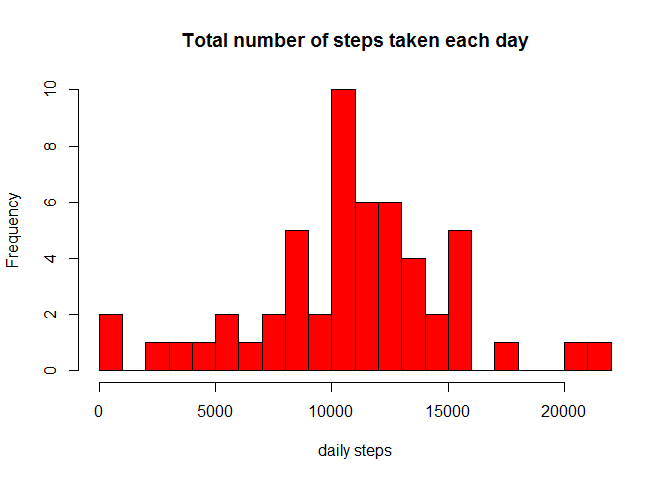
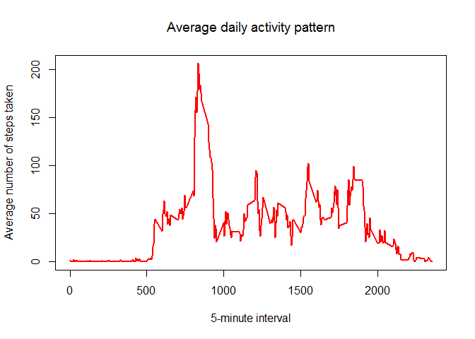
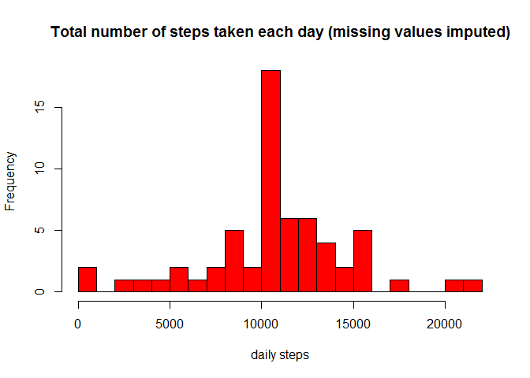
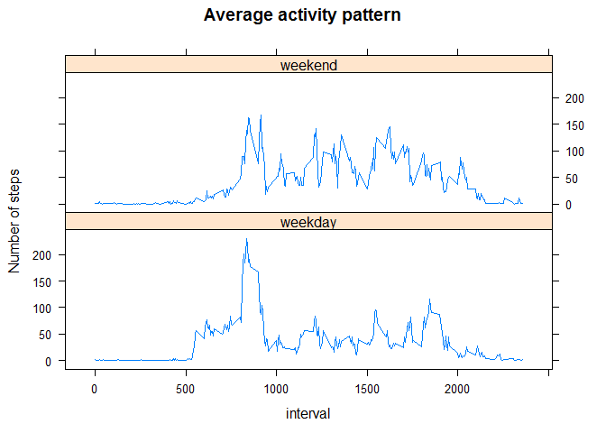

# Assignment: Course Project 1

1. Code for reading in the dataset and/or processing the data:

```r
#load the data and process#
rawdata <- read.csv("activity.csv", header = TRUE)
row.has.na <- apply(rawdata, 1, function(x){any(is.na(x))})
dataNoNAs <- rawdata[!row.has.na,]
```

2. Histogram of the total number of steps taken each day:

```r
library(plyr)
totaldailysteps<- ddply(dataNoNAs, .(date), summarise, totalsteps = sum(steps))
hist(totaldailysteps$totalsteps,breaks = 16,col="red",xlab="daily steps",main="Total number of steps taken each day",ps=9)
```

\

3. Mean and median of the total number of steps taken per day:

```r
mean(totaldailysteps$totalsteps)
```

```
## [1] 10766.19
```

```r
median(totaldailysteps$totalsteps)
```

```
## [1] 10765
```

4. Time series plot of the average number of steps taken:

```r
meanintervalsteps<- ddply(dataNoNAs, .(interval), summarise, avgsteps = mean(steps))
with(meanintervalsteps,plot(interval, avgsteps, type = "l", lwd=2, col = c("red"),  xlab = "5-minute interval", ylab = "Average number of steps taken", main = expression("Average daily activity pattern")))
```

\

5. The 5-minute interval that, on average, contains the maximum number of steps:

```r
meanintervalstepsordered<-arrange(meanintervalsteps, desc(avgsteps))
meanintervalstepsordered[1,1]
```

```
## [1] 835
```

6. Code to describe and show a strategy for imputing missing data:

```r
##STRATEGY: USE THE MEAN OF THE 5-MINUTE INTERVALS TO FILL THE DAYS WITH MISSING VALUES (NAs)
dataNAs<-rawdata[row.has.na,]
mergedtable<-merge(dataNAs,meanintervalsteps,by="interval")
fixeddata<-data.frame(mergedtable$avgsteps,mergedtable$date,mergedtable$interval)
colnames(fixeddata) <- c("steps", "date","interval")
fixeddatacomplete  <- rbind(fixeddata, dataNoNAs)
```

7. Histogram of the total number of steps taken each day after missing values are imputed:

```r
totaldailysteps2<- ddply(fixeddatacomplete, .(date), summarise, totalsteps = sum(steps))
hist(totaldailysteps2$totalsteps,breaks = 16,col="red",xlab="daily steps",main="Total number of steps taken each day (missing values imputed)",ps=9)
```

\

8. Panel plot comparing the average number of steps taken per 5-minute interval across weekdays and weekends:

```r
fixeddatacomplete2  <- fixeddatacomplete
Sys.setlocale("LC_TIME", "English")
```

```
## [1] "English_United States.1252"
```

```r
fixeddatacomplete2$date <- as.Date(fixeddatacomplete2$date, format = "%Y-%m-%d")
weekdays1 <- c('Monday', 'Tuesday', 'Wednesday', 'Thursday', 'Friday')
fixeddatacomplete2$wDay <- factor((weekdays(fixeddatacomplete2$date) %in% weekdays1),levels=c(FALSE, TRUE),labels=c('weekend', 'weekday'))
fixeddatacomplete2wdays<-fixeddatacomplete2[fixeddatacomplete2$wDay == 'weekday',]
fixeddatacomplete2wend<-fixeddatacomplete2[fixeddatacomplete2$wDay == 'weekend',]
meanintervalsteps2wdays<- ddply(fixeddatacomplete2wdays, .(interval), summarise, avgsteps = mean(steps))
meanintervalsteps2wdays$wDay<-'weekday'
meanintervalsteps2wend<- ddply(fixeddatacomplete2wend, .(interval), summarise, avgsteps = mean(steps))
meanintervalsteps2wend$wDay<-'weekend'
meanintervalsteps2<-rbind(meanintervalsteps2wdays, meanintervalsteps2wend)
library(lattice)
xyplot(avgsteps ~ interval|wDay,data=meanintervalsteps2, xlab="interval", ylab = "Number of steps", type = "l", main="Average activity pattern", layout=c(1,2))
```

\
